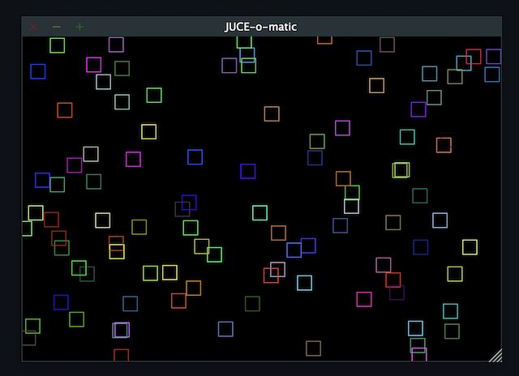

===================================================
Popsicle: Python integration for JUCE with pybind11
===================================================

|linux_builds| |macos_builds| |windows_builds| |pypi_version| |pypi_downloads|

|coveralls| |pypi_status| |pypi_license| |commercial_license|

--------
Overview
--------

Popsicle is a groundbreaking project designed to extend the accessibility of `JUCE <https://juce.com/>`_ by seamlessly integrating it with Python. Leveraging the power of `pybind11 <https://pybind11.readthedocs.io/en/stable/>`_, Popsicle offers a Pythonic interface to the JUCE framework. This integration allows developers to utilize JUCE in a manner similar to using Qt with PySide, offering a simplified yet robust approach.

Popsicle serves multiple purposes, each contributing to its significance in the development landscape.

--------
Features
--------

- **Effortless JUCE App Prototyping**: Effortlessly prototype JUCE apps. Popsicle streamlines the development process, allowing developers to focus on creativity by eliminating the need for intricate build configurations and setups.

- **Python Scripting Integration**: Seamlessly integrate Python scripting by embedding Popsicle into existing JUCE applications as a dedicated module. Extend and enhance your JUCE projects with the flexibility and ease of Python within the familiar JUCE framework.

- **Unit Testing Made Easy**: Ensure the robustness and reliability of JUCE classes with Popsicle's built-in unit testing support. Leverage Python's testing infrastructure for a seamless testing process.

- **Cross-Platform Compatibility**: Enjoy cross-platform compatibility with Popsicle. Work consistently across Windows, macOS, and Linux environments for a unified development experience.

Popsicle stands as a humble yet powerful solution, aimed at enriching the development experience with JUCE by simplifying, extending, and enhancing its integration with Python.

-------------
Example Usage
-------------

A single 80 lines script is better than thousand of words:

.. code-block:: python

  import popsicle as juce

  class MainContentComponent(juce.Component, juce.Timer):
      def __init__(self):
          juce.Component.__init__(self)
          juce.Timer.__init__(self)

          self.setSize(600, 400)
          self.startTimerHz(60)

      def __del__(self):
          self.stopTimer()

      def paint(self, g):
          g.fillAll(juce.Colours.black)

          random = juce.Random.getSystemRandom()
          rect = juce.Rectangle[int](0, 0, 20, 20)

          for _ in range(100):
              g.setColour(juce.Colour.fromRGBA(
                  random.nextInt(256),
                  random.nextInt(256),
                  random.nextInt(256),
                  255))

              rect.setCentre(random.nextInt(self.getWidth()), random.nextInt(self.getHeight()))
              g.drawRect(rect, 1)

      def timerCallback(self):
          if self.isVisible():
              self.repaint()

  class MainWindow(juce.DocumentWindow):
      component = None

      def __init__(self):
          super().__init__(
              juce.JUCEApplication.getInstance().getApplicationName(),
              juce.Desktop.getInstance().getDefaultLookAndFeel()
                  .findColour(juce.ResizableWindow.backgroundColourId),
              juce.DocumentWindow.allButtons,
              True)

          self.component = MainContentComponent()

          self.setResizable(True, True)
          self.setContentNonOwned(self.component, True)
          self.centreWithSize(800, 600)
          self.setVisible(True)

      def __del__(self):
          if self.component:
              del self.component

      def closeButtonPressed(self):
          juce.JUCEApplication.getInstance().systemRequestedQuit()

  class Application(juce.JUCEApplication):
      window = None

      def getApplicationName(self):
          return "JUCE-o-matic"

      def getApplicationVersion(self):
          return "1.0"

      def initialise(self, commandLine):
          self.window = MainWindow()

      def shutdown(self):
          if self.window:
              del self.window

  if __name__ == "__main__":
      juce.START_JUCE_APPLICATION(Application)

As easy as that ! You will find more example on JUCE usage in the *examples* folder.

-------------------
Supported Platforms
-------------------

.. list-table:: List of popsicle supported platforms
   :widths: 40 10 10 10 20
   :header-rows: 1

   * - Platform
     - Python 3.10
     - Python 3.11
     - Python 3.12
     - Notes
   * - macOS-universal2
     - ✅
     - ✅
     - ✅
     -
   * - win_amd64
     - ✅
     - ✅
     - ✅
     -
   * - win_arm64
     - ✅
     - ✅
     - ✅
     -
   * - manylinux_2014-x86_64
     - ✅
     - ✅
     - ✅
     -
   * - manylinux_2014-aarch64
     - ⚠️
     - ⚠️
     - ⚠️
     - Built but not tested exhaustively

-----------------
Supported Modules
-----------------

.. list-table:: List of popsicle supported JUCE modules
   :widths: 40 8 12 40
   :header-rows: 1

   * - Module
     - Supported
     - Test Coverage
     - Notes
   * - juce_analytics
     - ⛔️
     - N/A
     - Not Planned
   * - juce_audio_basics
     - ✅
     - 0.0%
     - In Progress
   * - juce_audio_devices
     - ✅
     - 0.0%
     - In Progress
   * - juce_audio_formats
     - ⛔️
     - N/A
     - Planned
   * - juce_audio_plugin_client
     - ⛔️
     - N/A
     - Not planned
   * - juce_audio_processors
     - ⛔️
     - N/A
     - Planned
   * - juce_audio_utils
     - ⛔️
     - N/A
     - Planned
   * - juce_box2d
     - ⛔️
     - N/A
     - Planned
   * - juce_core
     - ✅
     - 36.66%
     - Ready
   * - juce_cryptography
     - ⛔️
     - N/A
     - Planned
   * - juce_data_structures
     - ✅
     - 25.72%
     - Ready
   * - juce_dsp
     - ⛔️
     - N/A
     - Planned
   * - juce_events
     - ✅
     - 50.97%
     - Ready
   * - juce_graphics
     - ✅
     - 15.76%
     - In Progress
   * - juce_gui_basics
     - ✅
     - 9.53%
     - In Progress, Basic Components Available
   * - juce_gui_extra
     - ✅
     - 0.57%
     - In Progress
   * - juce_midi_ci
     - ⛔️
     - N/A
     - Not Planned
   * - juce_opengl
     - ⛔️
     - N/A
     - Planned
   * - juce_osc
     - ⛔️
     - N/A
     - Not Planned
   * - juce_product_unlocking
     - ⛔️
     - N/A
     - Not Planned
   * - juce_video
     - ⛔️
     - N/A
     - Not planned

--------------------
Example Applications
--------------------

Some images of JUCE tutorials and other small apps ported to *popsicle*.

- Hot Reloading (`hotreload_main.py <examples/hotreload_main.py>`_ and `hotreload_component.py <examples/hotreload_component.py>`_)

   .. image:: images/hot_reloading_video.png
       :target: https://www.youtube.com/watch?v=nZUL_1Tnyy8

- Animated Component (https://docs.juce.com/master/tutorial_animation.html)

   .. image:: images/animated_component.png
       :target: examples/animated_component.py

- Advanced GUI layout techniques (https://docs.juce.com/master/tutorial_rectangle_advanced.html)

   .. image:: images/layout_rectangles.png
       :target: examples/layout_rectangles.py

- Responsive GUI layouts using FlexBox and Grid (https://docs.juce.com/master/tutorial_flex_box_grid.html)

   .. image:: images/layout_flexgrid.png
       :target: examples/layout_flexgrid.py

- Table listbox (https://docs.juce.com/master/tutorial_table_list_box.html)

   .. image:: images/table_list_box.png
       :target: examples/table_list_box.py

- Slider values example (https://docs.juce.com/master/tutorial_slider_values.html)

   .. image:: images/slider_values.png
       :target: examples/slider_values.py

- Audio Player (https://docs.juce.com/master/tutorial_playing_sound_files.html)

   .. image:: images/audio_player.png
       :target: examples/audio_player.py

- OpenCV Integration

   .. image:: images/opencv_integration.png
       :target: examples/opencv_integration.py

- Matplotlib Integration

   .. image:: images/matplotlib_integration.png
       :target: examples/matplotlib_integration.py

-------------
Code Coverage
-------------

|coveralls|

**The current code coverage of the project refers to the combined JUCE + popsicle**

Popsicle places a strong emphasis on comprehensive code coverage to ensure the reliability and quality of the project. Our code coverage encompasses thorough testing of the JUCE framework, providing developers with confidence in the stability and performance of their applications.

To explore detailed information about the testing, refer to the `tests directory <tests/>`_ in our GitHub repository. This resource offers insights into the specific areas of the JUCE framework that have been rigorously tested, empowering developers to make informed decisions about the robustness of their implementations.

At Popsicle, we believe that extensive code coverage is essential for delivering software solutions that meet the highest standards of excellence. Feel free to delve into our testing documentation to gain a deeper understanding of the meticulous approach we take towards ensuring code quality and reliability.

---------
Licensing
---------

Popsicle is offered in two distinct licensed flavors to cater to diverse usage scenarios:

- **GPLv3 License**: This license is applicable when utilizing Popsicle from Python through the PyPi-provided wheels or embedding it in an open-source (OSS) application. Embracing the principles of open-source development, the GPLv3 license ensures that Popsicle remains freely accessible and modifiable within the open-source community.

- **Commercial License**: Tailored for scenarios where Popsicle is integrated into a closed-source application, the commercial license provides a flexible solution for proprietary software development. This option offers a streamlined approach for utilizing Popsicle within closed environments, with further details to be announced.

Popsicle's dual licensing approach ensures compatibility with a wide range of projects, whether they align with open-source principles or require the flexibility of a commercial license for closed-source applications.

**It's important to note that when Popsicle is employed in a closed-source application, a corresponding JUCE license is also required to ensure proper adherence to licensing requirements.**

------------
Installation
------------

Getting started with Popsicle is a straightforward process, requiring just a few simple steps. Follow the instructions below to install Popsicle effortlessly:

.. code-block:: bash

  pip3 install popsicle

Ensure that you have an up-to-date version of **pip** to ensure a smooth installation process.

Be sure you follow the `quick start guide <docs/QuickStartGuide.rst>`_ to know more abut how to use **popsicle**.

-----------------
Build From Source
-----------------

Clone the repository recursively as JUCE is a submodule.

.. code-block:: bash

  git clone --recursive git@github.com:kunitoki/popsicle.git

Install python dependencies.

.. code-block:: bash

  # Build the binary distribution
  python -m build --wheel

  # Install the local wheel
  pip3 install dist/popsicle-*.whl

.. |linux_builds| image:: https://github.com/kunitoki/popsicle/workflows/Linux%20Builds/badge.svg
    :alt: Linux Builds Status
    :target: https://github.com/kunitoki/popsicle/actions/workflows/build_linux.yml

.. |macos_builds| image:: https://github.com/kunitoki/popsicle/workflows/macOS%20Builds/badge.svg
    :alt: macOS Builds Status
    :target: https://github.com/kunitoki/popsicle/actions/workflows/build_macos.yml

.. |windows_builds| image:: https://github.com/kunitoki/popsicle/workflows/Windows%20Builds/badge.svg
    :alt: Windows Builds Status
    :target: https://github.com/kunitoki/popsicle/actions/workflows/build_windows.yml

.. |coveralls| image:: https://coveralls.io/repos/github/kunitoki/popsicle/badge.svg
    :alt: Coveralls - Code Coverage
    :target: https://coveralls.io/github/kunitoki/popsicle

.. |commercial_license| image:: https://img.shields.io/badge/license-Commercial-blue
    :alt: Commercial License
    :target: LICENSE.COMMERCIAL

.. |pypi_license| image:: https://img.shields.io/pypi/l/popsicle
    :alt: Open Source License
    :target: LICENSE.GPLv3

.. |pypi_status| image:: https://img.shields.io/pypi/status/popsicle
    :alt: PyPI - Status
    :target: https://pypi.org/project/popsicle/

.. |pypi_version| image:: https://img.shields.io/pypi/pyversions/popsicle
    :alt: PyPI - Python Version
    :target: https://pypi.org/project/popsicle/

.. |pypi_downloads| image:: https://img.shields.io/pypi/dm/popsicle
    :alt: PyPI - Downloads
    :target: https://pypi.org/project/popsicle/
